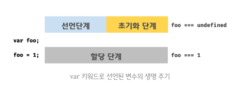

# Scope (부제: var, let, const)
---

# 목차

[[toc]]

## Scope란?

::: tip Javascript의 스코프 요약
자바스크립트에서 스코프(scope)란 변수나 함수가 가지는 유효 범위를 말한다.
:::

자바스크립트를 사용하여 개발을 진행하다보면 `전역 변수 오염`이라는 말을 종종 보게될 것이다.  
ES5를 사용하던 시절에는 변수의 선언 위치나 선언하는 방법에 따라 값이 달라지기 때문에, 변수가 오염되지 않도록
신경써야했다.

ES6를 사용하는 현재, 스코프에 대한 개념을 몰라도 코딩하는 것에 문제는 없지만, 자바스크립트의 특징이기 때문에 코딩을 하면서 발생하는 문제를 이해하기 위해서는 반드시 필요하고 알아둬야하는 개념이다.

따라서, 이 글의 내용은 스코프에 대해 공부하고 알게된 것을 정리한 것이다.

## 자바스크립트에서 전역 변수, 변수는 어떻게 오염되나?
변수가 오염되는 가장 일반적인 경우는 *변수명이 동일*하여 *변수가 재할당*되는 경우일 것이다.  
이유는 여러가지가 있지만 `var 키워드`와 `함수 레벨 스코프` 때문에 빈번하게 일어난다고 보면 된다.

### 1. var 키워드
ES5에서 변수를 선언하는 방법은 `var` 키워드를 사용하는 것이 유일하다.

> 💡 먼저, var를 통한 변수 선언 과정에 대해서 간단하게 알아보자. (이후 따로 포스팅하여 자세히 설명 예정)  
>   
> var의 변수 선언 과정은 3단계로 진행되는데 선언, 초기화 단계는 동시에 진행되며, 할당(3)은 변수에 할당되는 코드에 도달하면 이루어진다.
 
아래는 `var` 키워드로 선언한 변수의 문제점이다. ~~(사실 자바스크립트의 특징(오류)이라고 보는 것이 더 정확하다)~~

|   번호   | 종류            | 문제점                                      |
|:------:|---------------|:-----------------------------------------|
|   1    | 중복 선언 허용      | 의도하지 않은 재할당이 발생할 수 있음                    |
|   2    | var 키워드 생략 가능 | 의도하지 않은 변수의 전역화나 선언, 재할당이 발생할 수 있음       |
|   3    | 변수 호이스팅       | 변수를 선언하기 전에 참조가 가능하여 선언 시점이 애매모호 해질 수 있음 |


```js
console.log(name); // ① undefined : 문제점3 - 변수 호이스팅
name = 'capt'
console.log(name); // ② capt : 문제점2 - var 키워드 생략 가능
var name = 'iron_man';
var name = 'iron_man2';
console.log(name); // ③ iron_man2 : 문제점1 - 중복 선언 허용
{
  var name = 'hulk';
}
console.log(foo); // ④ hulk
```

---
① 에서 에러가 아닌 undefined가 콘솔에 찍히게 되는데, 에러가 발생하지 않는 이유는 `호이스팅` 이 발생하여 스코프 최상단으로 `var name;`이 끌어올려지기 때문이다.(엄밀히 말하면 global object에 name이 선언되고 undefined로 초기화되는 것)  
- [결론] 콘솔에서 에러가 발생하지 않아 변수가 선언된 것을 파악하기 어려운 상황이 발생할 수 있다.
---
② 에서 capt는 이미 호이스팅으로 인해 name 변수가 선언, 초기화가 되어있어 할당되었다고도 볼 수 있지만, 실제로는 문제점2의 이유로 생략하여도 에러가 발생하지 않는다.
- [결론] 이전에 변수가 선언되었는지 파악하기 어려운 상황이 발생 할 수 있음
---
③ 에서는 var name이 선언되어있지만, 다시 선언하여도 에러가 발생하지 않는 것을 확인 할 수 있다.
- [결론] 이전에 변수가 선언되었는지 파악하기 어려운 상황이 발생 할 수 있음
---
④ 은 다음으로 설명할 `함수 레벨 스코프`의 내용이다.
- [결론] 코드에서는 블록 레벨 스코프를 나타내는데, 블록 레벨에서는 전역으로 선언되어, name 변수에 재할당 되는 것을 알 수 있다.
---

따지고보면 **"변수명이 동일하지 않게 잘 개발하면 되는거 아닌가?"** 라고 생각해볼수 있지만, 점점 늘어나는 코드라인과 유지보수와 관리를 위해 파일을 분리하다보면 변수명이 겹치는 경우는 높은 확률로 발생할 수 있다.

이외에도 자바스크립트의 *변수 선언*은 다른 언어와는 다르게 타입(type)을 부여하지 않고 유연하게 타입이 부여되는 등의 특징이면서 문제점이 있다.
이런 유연함은 장점이기도 하지만, 오류가 발생하기 쉽게 만들기 때문에 주의해야한다.

### 2. 함수 레벨 스코프

```javascript {2,7,18}
// testComponent.js - html에 import
(function() {
  'use strict';
  window.components = window.components || {}
  var COMPONENT_NAME = 'test'
  
  var component = function(containerClass) {
    var defaultPrarms = {
      data: [],
      isApiDone: false,
    }
    this.options = Object.assign({}, defaultPrarms);
    var $container = document.querySelector(containerClass)
    if (!$container) { return; }
    this.init();
  }

  component.prototype = {
    init: function () {
      this.setElement();
      ...
    },
    setElement: function () {
      ...
    }
  }
  window.components[COMPONENT_NAME] = component;
}());

// app.js
window.components.test().init('.app_container')
```

위의 코드는 ES5를 사용하며 개발하던 시절에 실제로 사용하던 코드의 예시이다. 코드를 보면 `component`라는 함수를 선언하고 defaultParams라는 객체 변수를 선언했다.

당시 개발하면서 크게 의문을 갖지않고 컨벤션에 맞춰 개발을 진행했지만, 스코프 개념을 알게되면서 해당 방법이 `전역 변수`로 인한 변수 오염 방지를 위해 함수를 선언한 것을 알 수 있었다.

그렇다면 왜 함수를 선언하고 그 안에서 변수를 선언한 것일까?

| 종류            | 특징                                                 | 예시                      |
|---------------|:---------------------------------------------------|-------------------------|
| 블록 레벨 스코프 | 코드 블록 내에서 선언된 변수는 블록 내에서만 유효하다. 블록 외부에서는 참조할 수 없다. | if, switch, for, while 등 | 
| 함수 레벨 스코프 | 함수 내에서 선언된 변수는 함수 내에서만 유효하며, 함수 외부에서는 참조할 수 없다.    | function                |

스코프는 보통 2가지가 있는데, 대부분의 경우 `블록(block) 레벨 스코프`를 따르지만, 자바스크립트는 `함수 레벨 스코프`를 따른다.  
위의 설명대로 함수 레벨 스코프에서는 함수 내에 선언된 변수를 외부에서 참조할 수 없기 때문에 `defaultParams` 변수를 다른곳에서 선언해도 **test 컴포넌트**의 defaultParams 변수가 영향을
받아 오염될 염려를 하지 않아도 된다.